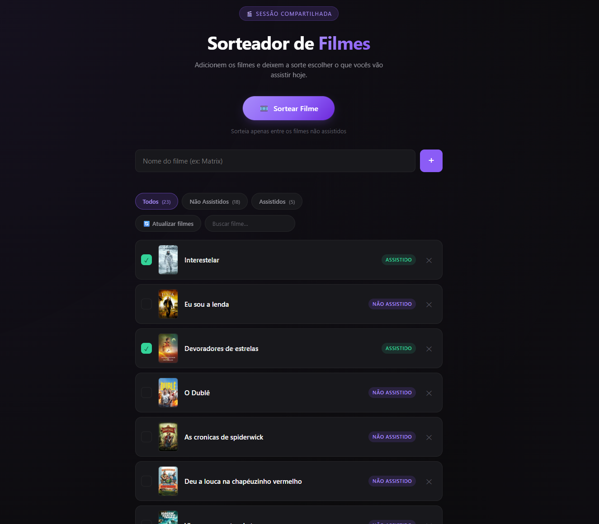
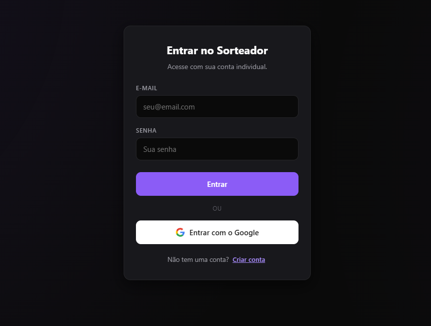

# 🎬 Sorteador de Filmes Compartilhado

Aplicação web para criar listas colaborativas de filmes, sincronizadas em tempo real. Permite que grupos de amigos, casais ou famílias organizem o que querem assistir, sorteiem filmes aleatoriamente e troquem avaliações e comentários.

---

## ✨ Funcionalidades

### 🔐 Autenticação

- Login com e-mail e senha
- Cadastro de novos usuários
- Login com Google (OAuth)
- Sessão persistente entre acessos

### 👥 Listas Compartilhadas

- Criação de lista com código único gerado automaticamente
- Entrada em listas existentes via código
- Sincronização em tempo real para todos os participantes via Firestore

### 🎥 Gerenciamento de Filmes

- Adicionar filmes pelo nome (busca automática no TMDB)
- Dados enriquecidos buscados automaticamente: pôster, sinopse, gêneros, ano de lançamento, duração e nota TMDB
- Sinopse em português (PT-BR), com fallback automático para inglês quando não houver tradução
- Marcar filme como assistido / desmarcar
- Remover filme da lista
- Pesquisa por nome na lista atual
- Filtros: **Todos**, **Não assistidos**, **Assistidos**
- **Atualizar todos os filmes**: re-busca os dados TMDB de toda a lista de uma só vez

### 🎲 Sorteio

- Sorteia aleatoriamente entre os filmes **não assistidos**
- Animação de suspense estilo roleta
- Modal de resultado com pôster e título do filme sorteado
- Opção de marcar o filme sorteado como assistido diretamente no modal

### ℹ️ Modal de Informações

Ao clicar em um filme, um modal exibe:

- Pôster em alta resolução
- Título, ano de lançamento e duração
- Gêneros (badges)
- Nota do TMDB
- Sinopse completa
- Seção de comentários e avaliações do grupo

### 💬 Comentários e Avaliações

- Qualquer participante autenticado pode comentar em cada filme
- Avaliação de 1 a 5 estrelas por comentário
- Média de avaliações exibida no topo da seção
- Editar e excluir os próprios comentários
- Atualizações em tempo real via Firestore

---

## 🛠️ Tecnologias

| Camada | Tecnologia |
|---|---|
| Frontend | HTML5, CSS3, JavaScript (ES Modules nativos) |
| Autenticação | Firebase Authentication (email/senha + Google) |
| Banco de dados | Firebase Firestore (tempo real) |
| Dados de filmes | TMDB API v3 |

Não há bundler, transpilador ou framework de UI — o projeto roda direto no browser com módulos ES nativos e dependências via CDN.

---

## 📂 Estrutura do Projeto

```text
sorteador_filmes/
├── index.html           # Único ponto de entrada — HTML completo da aplicação
├── firestore.rules      # Regras de segurança do Firestore
└── src/
    ├── css/
    │   └── styles.css   # Todos os estilos da aplicação
    └── js/
        ├── firebase.js  # Inicialização do Firebase (app, auth, db)
        ├── auth.js      # Estado de autenticação e operações de login/logout
        ├── tmdb.js      # Integração com a API do TMDB
        ├── movies.js    # CRUD de filmes e comentários + batch refresh
        └── ui.js        # Toda a lógica de UI, DOM e eventos (entry point)
```

### Responsabilidades dos módulos

**`firebase.js`** — inicializa o Firebase e exporta `auth` e `db`.

**`auth.js`** — gerencia o estado do usuário logado. Exporta `initAuth`, `signInEmail`, `signUpEmail`, `signInGoogle` e `logout`.

**`tmdb.js`** — `fetchMovieDetails(title)` faz duas chamadas à API (busca → detalhes) e retorna `{ posterUrl, synopsis, genres, releaseYear, runtime, tmdbRating, tmdbId }`.

**`movies.js`** — toda a comunicação com o Firestore:
- `setupMoviesSubscription` / `unsubscribeMovies` — snapshot em tempo real da lista
- `addMovie`, `removeMovie`, `toggleWatched` — CRUD de filmes
- `subscribeToComments`, `addComment`, `updateComment`, `deleteComment` — CRUD de comentários
- `refreshAllMovies` — re-busca TMDB para cada filme da lista com delay de 350 ms entre chamadas

**`ui.js`** — importa todos os módulos acima e conecta a interface ao estado da aplicação. É o único arquivo carregado pelo `index.html`.

---

## 🗄️ Estrutura do Firestore

```text
lists/
└── {listCode}/
    └── movies/
        └── {movieId}/
            ├── title, watched, posterUrl, synopsis
            ├── genres[], releaseYear, runtime
            ├── tmdbRating, tmdbId
            └── comments/
                └── {commentId}/
                    ├── userId, userName
                    ├── text, rating (1–5)
                    └── createdAt, updatedAt
```

---

## 🔒 Regras de Segurança (Firestore)

Definidas em `firestore.rules`:

- Listas e filmes: leitura e escrita apenas para usuários autenticados
- Comentários:
  - **Leitura**: qualquer usuário autenticado
  - **Criação**: usuário autenticado, com `userId == auth.uid`
  - **Edição / exclusão**: apenas o autor do comentário (`resource.data.userId == auth.uid`)

> As regras devem ser publicadas no [Firebase Console](https://console.firebase.google.com) ou via Firebase CLI.

---

## ⚙️ Configuração

### 1. Clonar o repositório

```bash
git clone https://github.com/seu-usuario/sorteador-filmes.git
cd sorteador-filmes
```

### 2. Criar projeto no Firebase

Acesse [console.firebase.google.com](https://console.firebase.google.com) e:

1. Crie um novo projeto
2. Ative o **Firebase Authentication** (provedores: E-mail/Senha e Google)
3. Crie um banco **Firestore Database** (modo produção)
4. Copie as credenciais do app Web e substitua o objeto `firebaseConfig` em `src/js/firebase.js`

### 3. Publicar as regras do Firestore

Copie o conteúdo de `firestore.rules` e publique em:  
**Firebase Console → Firestore → Regras**

### 4. Obter chave da API do TMDB

1. Crie uma conta em [themoviedb.org](https://www.themoviedb.org)
2. Gere uma API Key em **Configurações → API**
3. Substitua a constante em `src/js/tmdb.js`:

```javascript
const TMDB_API_KEY = "SUA_API_KEY";
```

---

## 🚀 Executando o Projeto

O projeto usa ES Modules nativos e requer um servidor HTTP local (não funciona abrindo o arquivo diretamente).

**Opção 1 — VS Code Live Server:**

1. Instale a extensão [Live Server](https://marketplace.visualstudio.com/items?itemName=ritwickdey.LiveServer)
2. Clique com botão direito em `index.html` → **Open with Live Server**

**Opção 2 — Python:**

```bash
python -m http.server 8000
```

Acesse `http://localhost:8000`

**Opção 3 — Node.js (npx):**

```bash
npx serve .
```

---

## 📸 Capturas de Tela

Adicione aqui imagens da aplicação em funcionamento.

```markdown


```

---

## 📄 Licença

Este projeto foi desenvolvido para fins de estudo e uso pessoal.

---

## 👨‍💻 Autor

Lucas Alves Lougon

GitHub:
https://github.com/LucasAlvesLougon
